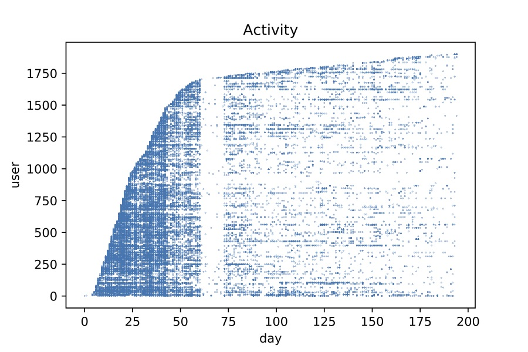
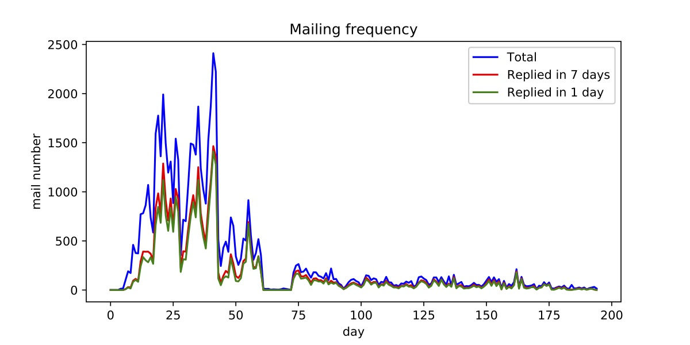
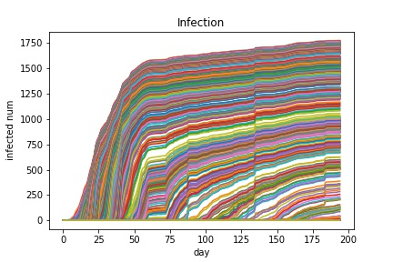
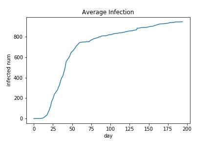
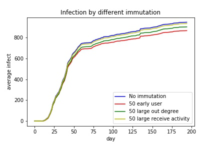

http://snap.stanford.edu/data/CollegeMsg.html

## Dataset

4月15日 7.56 ～ 10月26日 0.52
nodes: 1899
active: 1893

not in global: 228 229 1796 1797 1811 1812

### General

general mailing frequency by time(only send)

reciprocate(effective communication(quality))

### Viral spreading

(temporal network)

Question: How to select immutation nodes to reduce infection?

### Typical users

1. freq
2. active days
3. spammer(send a lot)

Immutate nodes

(temporal & static ?)

